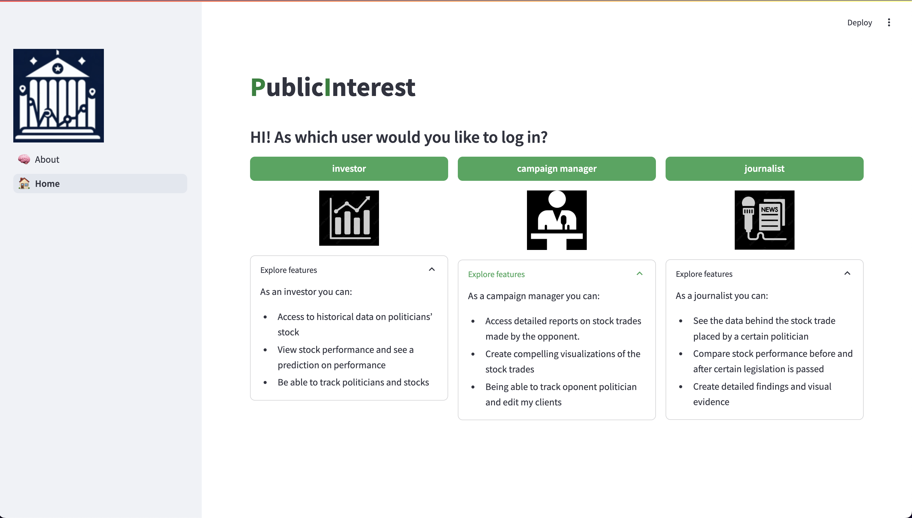
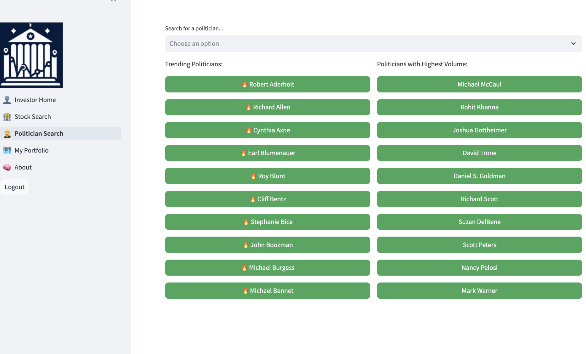
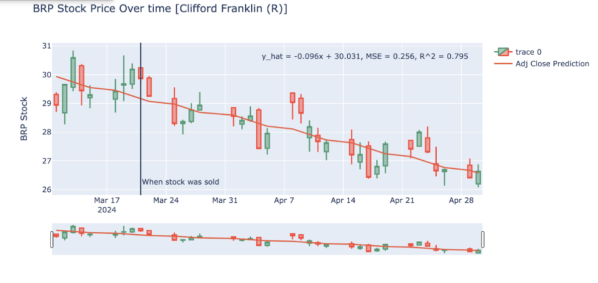
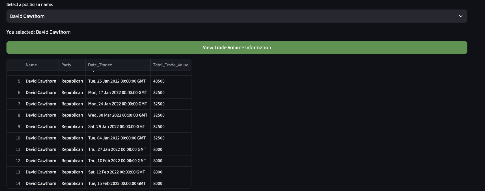
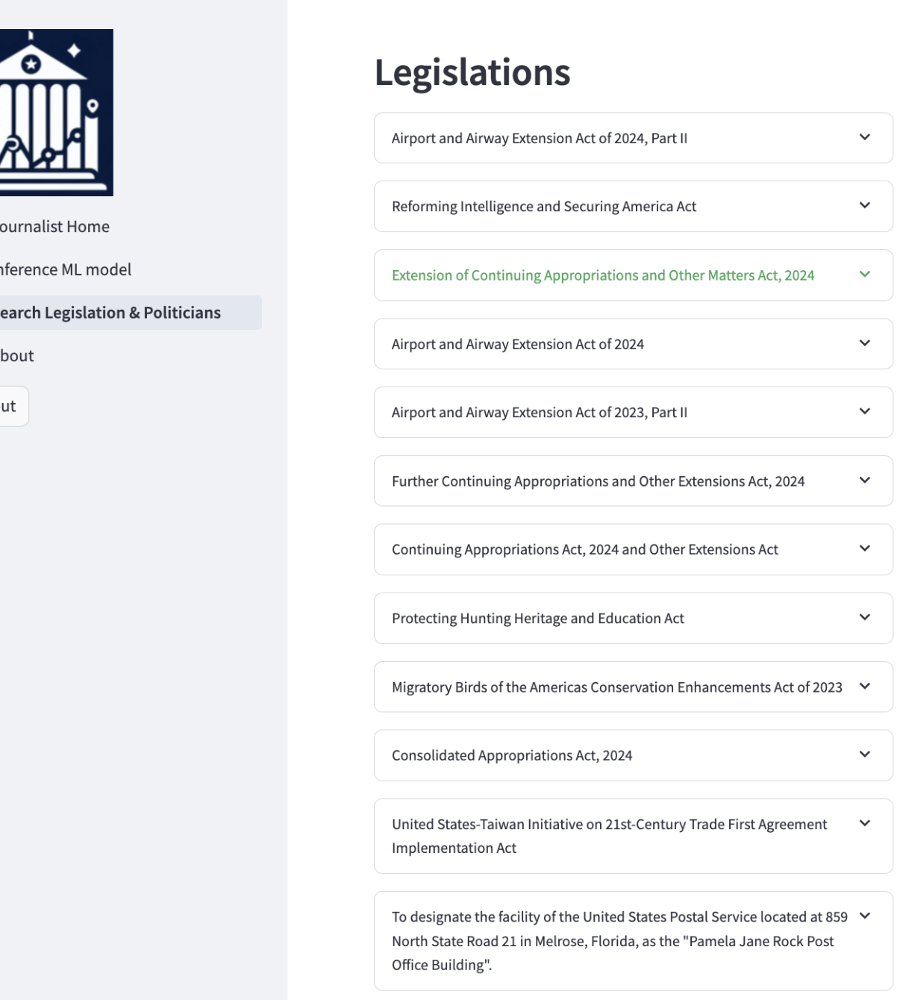

Public Interest is a cutting-edge web app, designed to revolutionize the way you approach stock investments and political transparency. Our platform offers powerful tools to:

- track stock performance
- predict market trends
- gain insights into the trading activities of politicians

By leveraging this information, you can make more informed investment decisions and contribute to a more transparent and accountable political environment.

Key Features

1. Comprehensive Stock and Politician Database
Extensive Database: Our platform utilizes a robust database of stocks and politicians, ensuring comprehensive coverage and up-to-date information.
CS3200 Integration: The database and routes for the features and machine learning models were meticulously created by CS3200, providing an efficent implementation. 
Data Management: Efficiently manage and retrieve stock data through well-structured routes, enabling smooth functionality for all features.

2. Advanced Machine Learning Models
Linear Regression Model: Developed by DS3000 team, this model uses three years of politicians' trading data to predict stock movements based on their trading values.
LSTM Model: Another model by DS3000 team, this Long Short-Term Memory (LSTM) model predicts stock prices based solely on historical price and date data, using deep learning for more accurate predictions.

3. Politician Trades Monitoring
Transparency: Access detailed records of buying and selling activities by politicians.
Strategic Insights: Gain valuable insights by analyzing the trades of politicians, who often have access to insider information.

4. Legislation Exploration
Investigate 1000+ pieces of current and past legislation, track their progress, see who supports them, and who made stock transactions around milestones of the legislation.

5. Personalized Portfolio Management
Custom Tracking: Add your preferred stocks and politicians to your personal portfolio for tailored updates.

## Benefits

Informed Investment Decisions

Our platform empowers you with predictive analytics and real-time data, enabling you to anticipate market movements and make informed investment choices.

Enhanced Transparency

By monitoring the financial activities of politicians, you gain insight into potential future regulations and market shifts, promoting a more transparent political system.
